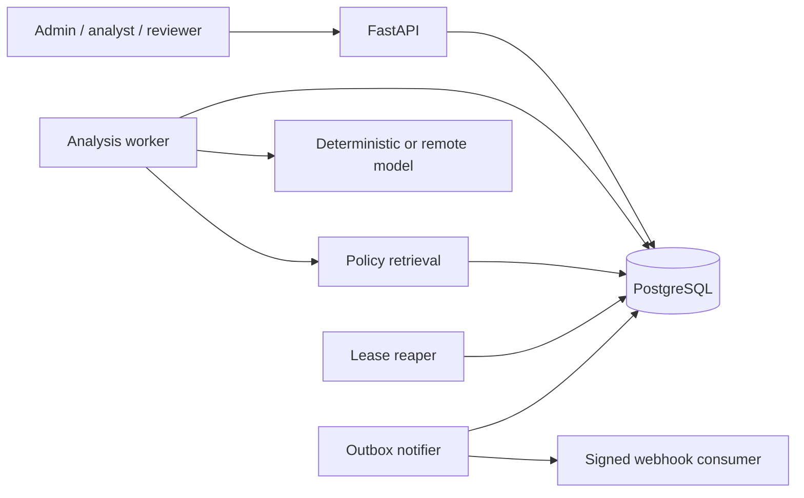

# AI Compliance Agent

A production-oriented reference implementation of a human-reviewed compliance analysis workflow.
It places an LLM behind deterministic retrieval, structured output, citation validation, confidence
controls, durable processing, and an immutable review boundary instead of presenting a chatbot as
an enterprise control.

```text
document -> hash -> policy retrieval -> structured model analysis
         -> deterministic validation -> human review -> audit + signed notification
```

This project demonstrates architecture and engineering practices. It does not provide legal advice,
replace compliance professionals, claim regulatory certification, or reproduce a client system.

## Why this is not a chatbot

The model has no authority to mutate policies or finalize decisions. Every completed analysis:

1. uses a versioned prompt and active policy versions;
2. returns a strict typed result with source citations;
3. passes deterministic citation and confidence checks;
4. records prompt-injection signals;
5. transitions to mandatory human review;
6. becomes approved or rejected only by an authorized reviewer;
7. binds the review to a hash of the exact analysis snapshot.

## Engineering evidence

| Concern | Implementation |
| --- | --- |
| Reproducibility | deterministic local provider, pinned direct dependencies, Docker and Compose |
| Structured AI | strict JSON-schema request and Pydantic response validation |
| Grounding | deterministic retrieval of active policy versions and exact-quote validation |
| Hallucination mitigation | retrieved-source checks, confidence finding, mandatory review |
| Prompt injection | untrusted-document envelope, signal detection, no model-controlled actions |
| Durable execution | PostgreSQL queue, worker leases, attempts, reaper, fencing tokens |
| Idempotency | database-enforced case key and webhook delivery ID |
| Human accountability | reviewer RBAC, rationale, analysis hash, unique immutable review |
| Side effects | transactional outbox, HMAC-signed webhook, retries, dead-letter state |
| Security | OIDC/JWKS validation, RBAC, byte limits, redacted provider failures |
| Observability | health/readiness, Prometheus metrics, token/latency/cost persistence, audit events |
| Delivery | Alembic round trips, coverage gate, pinned CI actions, non-root container |

## Architecture



See:

- [Architecture and trust boundaries](docs/ARCHITECTURE.md)
- [Workflow and recovery sequences](docs/SEQUENCES.md)
- [Threat model](docs/THREAT_MODEL.md)
- [Failure model](docs/FAILURE_MODEL.md)
- [Operational runbook](docs/RUNBOOK.md)
- [Architecture decisions](docs/adr)
- [Portfolio evidence map](docs/PORTFOLIO_EVIDENCE.md)
- [Principal Engineer self-review](docs/PRINCIPAL_ENGINEER_REVIEW.md)
- [Risk-driven roadmap](docs/ROADMAP.md)

## Quick start

Requirements: Docker Engine with Compose v2.

```bash
docker compose up --build -d
docker compose ps
curl --fail http://localhost:8001/health
curl --fail http://localhost:8001/ready
```

The default stack starts:

- PostgreSQL 17;
- one-shot Alembic migrations;
- FastAPI;
- an analysis worker;
- an expired-lease reaper.

Webhook delivery is an opt-in profile because it requires an external endpoint and signing secret.
See the [runbook](docs/RUNBOOK.md) for startup and incident procedures.

Stop the stack:

```bash
docker compose down
```

## Local development

Supported Python versions are 3.11 through 3.13; CI uses Python 3.12.

```bash
python -m pip install -e '.[dev]'
alembic upgrade head
uvicorn app.main:app --reload
```

Run background processes in separate terminals:

```bash
python -m app.worker
python -m app.reaper
python -m app.notifier
```

SQLite is the credential-free default for local tests. PostgreSQL is the reference durable runtime.

## API surface

| Method | Endpoint | Roles | Purpose |
| --- | --- | --- | --- |
| `POST` | `/api/v1/policies` | admin | create a hashed policy version |
| `GET` | `/api/v1/policies` | any application role | list policy versions |
| `POST` | `/api/v1/prompts` | admin | create and optionally activate a prompt version |
| `GET` | `/api/v1/prompts` | any application role | list prompt versions |
| `POST` | `/api/v1/documents` | admin, analyst | ingest and hash a bounded document |
| `POST` | `/api/v1/cases` | admin, analyst | create an idempotent asynchronous analysis |
| `GET` | `/api/v1/cases/{id}` | any application role | read workflow and model evidence |
| `POST` | `/api/v1/cases/{id}/reviews` | admin, reviewer | approve or reject with rationale |
| `GET` | `/api/v1/cases/{id}/audit` | any application role | read ordered case audit events |
| `GET` | `/health` | public | process liveness |
| `GET` | `/ready` | public | database readiness |
| `GET` | `/metrics` | public in reference app | Prometheus exposition |

Production deployments should restrict operational endpoints at the network edge.

### Development authentication

Local development accepts `X-User-ID` and comma-separated `X-Roles` headers. If omitted, the
development default is a local administrator with all roles. This mode fails closed whenever
`COMPLIANCE_ENVIRONMENT` is not `development`.

### Production authentication

Set OIDC mode and configure issuer, audience, and JWKS URL. Bearer tokens are verified with RS256,
issuer, audience, and provider signing keys. Roles are read from the `roles` list and space-separated
`scope` claim.

## Model providers

### Deterministic

The default provider requires no credential. It selects retrieved policy evidence and returns a
stable review-required result, making the entire workflow and tests reproducible.

### OpenAI-compatible

The remote adapter sends:

- a versioned system prompt;
- an explicitly labeled untrusted document;
- retrieved policy IDs, names, versions, and content;
- the generated strict JSON schema for `ModelAnalysis`.

Configure the provider only through environment or managed deployment secrets. Provider errors are
stored as stable redacted application errors rather than raw response text.

## Configuration

All variables use the `COMPLIANCE_` prefix.

| Variable | Default | Purpose |
| --- | --- | --- |
| `DATABASE_URL` | local SQLite | SQLAlchemy database URL |
| `ENVIRONMENT` | `development` | enables local-only authentication guard |
| `AUTH_MODE` | `development` | `development` or `oidc` |
| `OIDC_ISSUER` | unset | expected token issuer |
| `OIDC_AUDIENCE` | unset | expected token audience |
| `OIDC_JWKS_URL` | unset | signing-key endpoint |
| `MODEL_PROVIDER` | `deterministic` | provider adapter |
| `MODEL_BASE_URL` | OpenAI API URL | remote provider base URL |
| `MODEL_NAME` | `gpt-4.1-mini` | remote model identifier |
| `MODEL_API_KEY` | unset | remote provider credential |
| `MODEL_INPUT_COST_PER_MILLION` | `0` | estimate configuration |
| `MODEL_OUTPUT_COST_PER_MILLION` | `0` | estimate configuration |
| `CONFIDENCE_THRESHOLD` | `0.7` | validation finding threshold |
| `MAX_DOCUMENT_BYTES` | `262144` | ingestion byte limit |
| `ANALYSIS_LEASE_SECONDS` | `120` | worker lease duration |
| `ANALYSIS_MAX_ATTEMPTS` | `3` | terminal attempt limit |
| `NOTIFICATION_WEBHOOK_URL` | unset | review event destination |
| `NOTIFICATION_WEBHOOK_SECRET` | unset | HMAC signing secret |
| `NOTIFICATION_LEASE_SECONDS` | `60` | notifier lease duration |
| `NOTIFICATION_MAX_ATTEMPTS` | `5` | dead-letter attempt limit |

`.env.example` documents local configuration names. Its values are not production credentials.

## Quality gates

```bash
ruff check app tests alembic
mypy app
pytest --cov=app --cov-report=term-missing --cov-fail-under=80
docker build -t ai-compliance-agent:local .
docker compose config --quiet
```

CI also verifies a PostgreSQL migration upgrade/downgrade/upgrade cycle. Tests never require a real
model API key.

## Repository structure

```text
app/api/             HTTP endpoints and role boundaries
app/core/            configuration and Prometheus metrics
app/domain/          persistence models, enums, and API/model schemas
app/infrastructure/  database sessions and authentication
app/services/        retrieval, providers, validation, workflow, audit, outbox
alembic/              versioned database migrations
tests/                deterministic workflow, security, provider, and recovery tests
docs/                 architecture, security, operations, decisions, and review
```

## License

[MIT](LICENSE)
