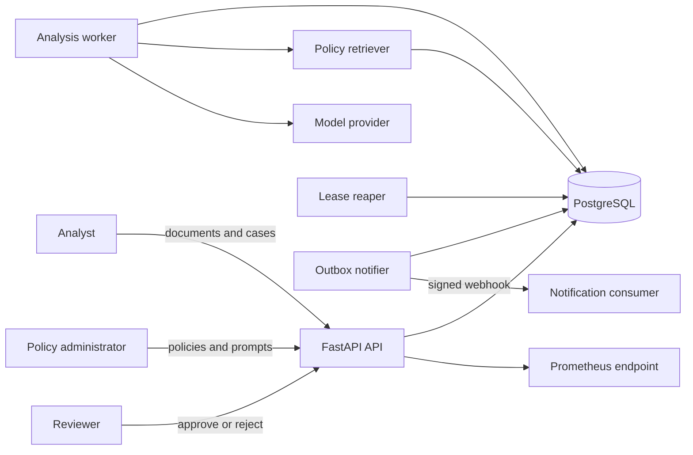
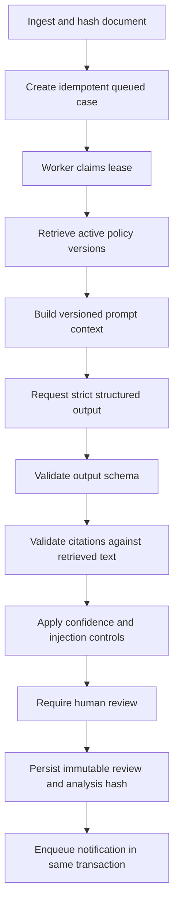
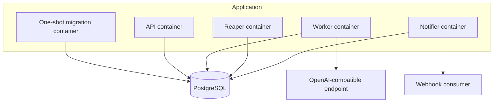

# Architecture

## Context and scope

This reference system analyzes untrusted documents against versioned compliance policies. The
model proposes a structured result; deterministic controls and an authorized reviewer decide
whether that result becomes an approved or rejected case. The model never writes a final decision
directly.

## Trust boundaries

| Boundary | Untrusted input | Control |
| --- | --- | --- |
| Client to API | identities, document text, identifiers | OIDC signature and claim validation, RBAC, Pydantic schemas, byte limit |
| Document to prompt | instructions embedded in content | explicit untrusted-document envelope, injection signal detection |
| Database to worker | concurrently claimed work | row locks, leases, attempt limits, fencing tokens |
| Model to application | malformed or unsupported output | strict JSON schema, Pydantic validation, citation checks, confidence threshold |
| Reviewer to final state | unauthorized or duplicate decisions | reviewer role, row lock, state precondition, unique review record |
| Notifier to consumer | spoofed or duplicate delivery | HMAC signature, idempotency key, retry limit, delivery fencing |

## Analysis pipeline

The retrieval implementation is deliberately deterministic and inspectable: lexical overlap ranks
only active policy versions. It is suitable as a reference boundary, not as a claim of semantic
retrieval quality.

## Durable processing

Cases move through `QUEUED -> ANALYZING -> REVIEW_REQUIRED -> APPROVED|REJECTED`. A worker claim
increments both `attempts` and `fencing_token` and receives a bounded lease. Final writes require
the worker identity, current token, active state, and an unexpired lease. A stale worker therefore
cannot overwrite a result produced after recovery.

The reaper returns expired cases to the queue until the configured attempt limit. Exhausted cases
become `FAILED` with an audit event. Notification delivery applies the same lease and fencing
pattern, then backs off failed attempts before moving exhausted records to `DEAD`.

## Data ownership

| Record | Purpose | Mutability |
| --- | --- | --- |
| Policy | versioned source material and content hash | new versions preferred over replacement |
| Prompt template | model instruction and output schema version | versioned; one active version per name |
| Document | source text and content hash | immutable by API |
| Compliance case | workflow and model result | state-machine updates |
| Review record | reviewer decision bound to analysis hash | one append-only record per case |
| Audit event | actor, correlation, event details | append-only by service convention |
| Notification outbox | durable integration delivery | controlled delivery state transitions |

## Runtime topology

All application processes use the same immutable image with different commands. The image runs as
a non-root user. The notification process is an opt-in Compose profile because it requires a
managed signing secret and an external endpoint.

## Deliberate limitations

- No legal or regulatory conclusion is automated; every successful analysis requires review.
- Lexical retrieval is transparent but does not provide embedding-based recall.
- Document content is stored in PostgreSQL for clarity; a production deployment may use encrypted
  object storage with retention controls.
- OIDC roles are accepted from configured claims; production deployments must align them with the
  identity provider's claim contract.
- Metrics are process-local and intended for Prometheus scraping, not cross-process aggregation.
