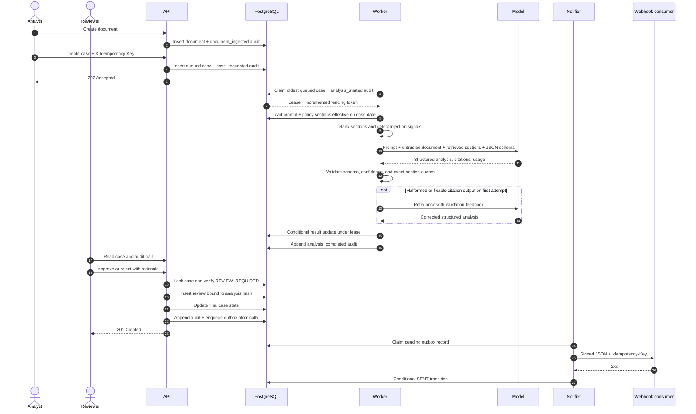
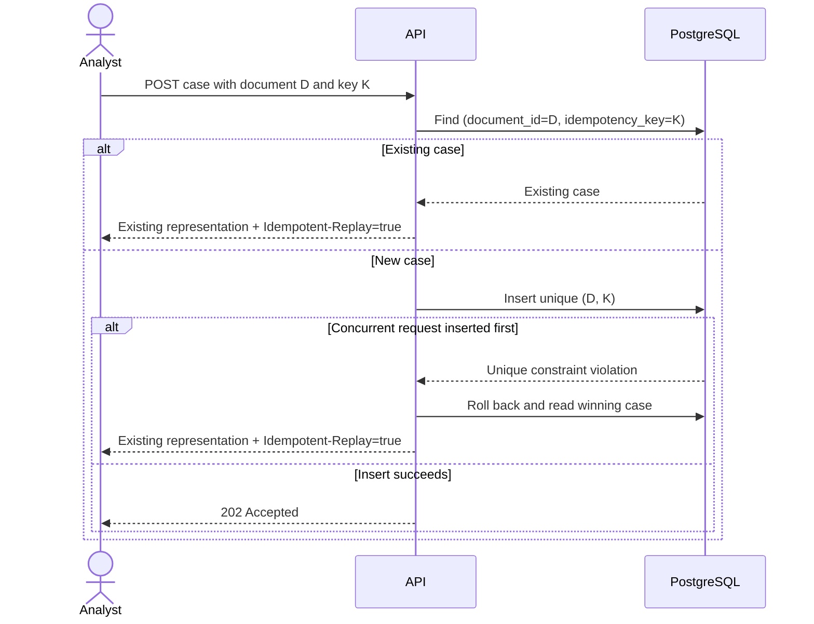
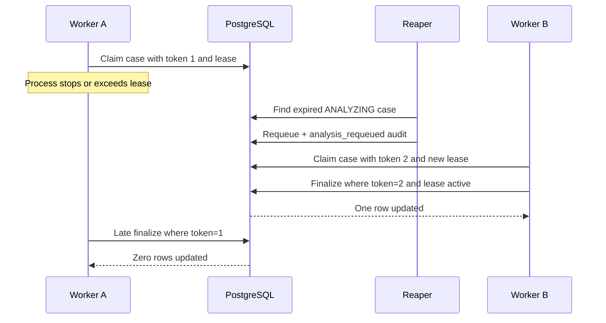
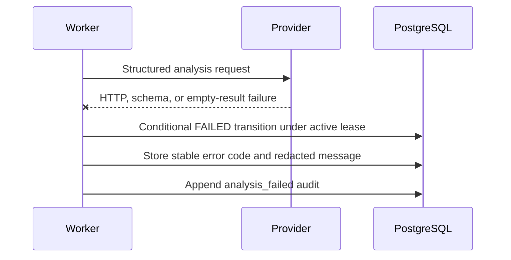
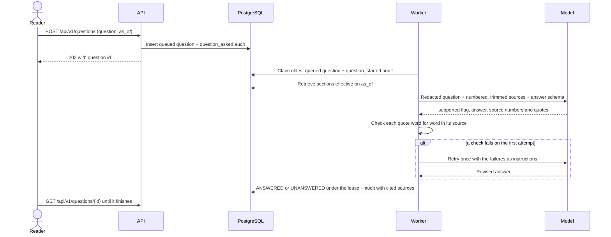
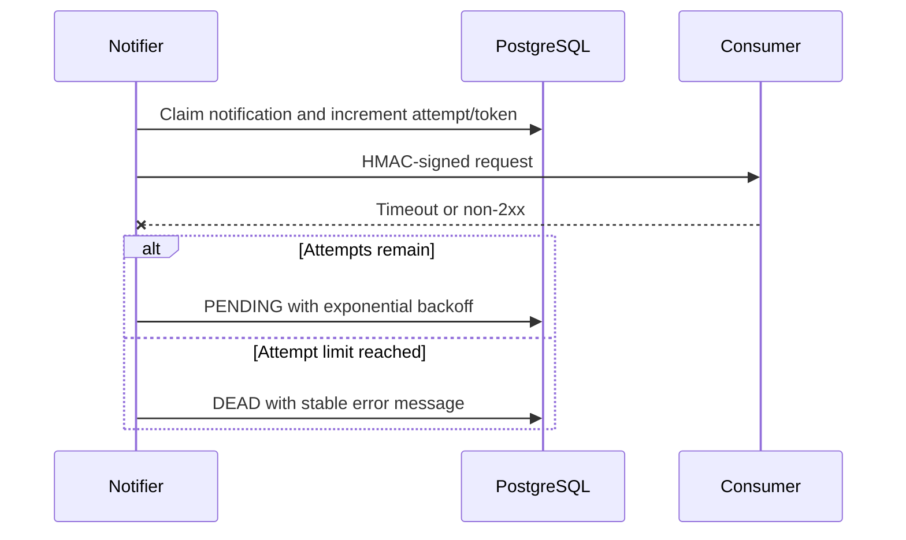

# Workflow sequences

## Analyze and review a document

## Idempotent case submission

## Expired analysis lease

## Provider failure

The API does not expose raw provider exceptions, response bodies, or credentials.

## Answer a policy question

An unanswered question still returns the sources the model was given.

## Notification retry and dead letter

